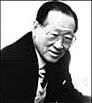

<!DOCTYPE html>
<html>
<body>

<h3 align="center">Our Hyundai's Motor company founding chairmain</h1>
<h5>**RIP**</h5>

<h4 align="left">Our founding chairmain
<h5 align="left"> Chung Ju Yung: 1915-2001 </h5>

<h6 align="left"> Chung Ju Yung or Jung-Joo Yung was born in 1915 Tangchon, Empire of Japan(now Kangwon Province,North Korea). He was a entrepuneur and founder of Hyundai. He was the eldest of a poor Korean farmers. Chung had a hard life, his family sometimes couldn't afford to feed each other though they worked in the feilds for 17 hours a day. He sold wood in a nearby city to have enough income for the family but sometimes that wouldn't be enough . But after all the struggles, he became the richest person in South Korea.  </h6>

